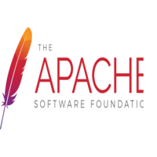

# Deliverable 1 Submission

## Basic Terminology

### What is a web server?

On the hardware side, a web server is a computer that stores web server software and the website's files.  A web server connects to the Internet and supports physical data interchange with other devices connected to the web.

On the software side, a web server controls how users access hosted files. It consists of several components, housing at least an HTTP server. An HTTP server is software that can understand HTTP requests and URLs.

### What are some example web server applications?

| Application Name | License              | Project's Website                     |
| ---------------- | -------------------- | ------------------------------------- |
| Apache           | Apache License 2.0   | [apache](https://www.apache.org/)     |
| NGINX            | 2-clause BSD license | [nginx](https://www.nginx.com/)       |
| Lighttpd         | 3-clause BSD license | [lighttpd](https://www.lighttpd.net/) |

#### Apache
 
Apache is a popular, free, and open-source web server software used to serve web pages and applications over the internet. It's known for its reliability, scalability, and security features and supports a variety of programming languages. The Apache Software Foundation also develops other open-source software projects.

#### Nginx
 
NGINX is a popular open-source web server software that is used to serve web pages and applications over the internet. It was developed by NGINX, Inc. and is known for its high performance, scalability, and low resource usage. NGINX supports a range of features, including load balancing, reverse proxying, and caching, making it a popular choice for serving static and dynamic content on websites and web applications. It also offers advanced HTTP processing capabilities and supports multiple programming languages.

#### Lighttpd
 
Lighttpd is a free and open-source web server software that is designed for high-performance environments. It is known for its speed, low memory footprint, and efficiency in handling high traffic loads. Lighttpd is particularly suitable for serving static content, but it can also handle dynamic content.  It supports multiple programming languages and can be used on various operating systems, including Linux, macOS, and Windows.

### What is virtualization?
Virtualization is the process of creating a virtual version of a computer on a single, physical machine.  During virtualization, you use a hypervisor to allocate a certain amount of resources to your virtual computer.  This allows you to host multiple virtual computers on your machine.  Doing this allows you to more efficiently use the resources on your machine.

### What is VirtualBox?
 
VirtualBox is a free and open-source virtualization software.  It was developed by Oracle and is available for Windows, macOS, and Linux.

### What is a virtual machine?
A virtual machine is a virtual computer system that was created by a virtualization software.  The hardware components are all virtualized, like the RAM, CPU, and storage.

### What is Ubuntu Server?
 
Ubuntu Server is a version of the Ubuntu operating system specifically designed for use as a server.  It is a Linux-based operating system that provides a secure platform for running applications, services, and websites.  It is designed to be lightweight and optimized for server workloads, with minimal installed software packages to reduce the attack surface and increase security. It is also designed to be easily manageable and scalable, with built-in tools for system configuration and remote administration.  It is a popular choice for running web servers, database servers, and other server applications, thanks to its reliability, stability, and security features.

### What is a firewall?
A firewall is a security system on a computer that filters network traffic.  It can control and monitor inbound and outbound requests based on a set of security rules that you can configure.  It also acts as a barrier between a private internal network and the public Internet, preventing unauthorized access to or from the network while allowing legitimate traffic to pass through.

### What is SSH?
SSH, also known as Secure Shell or Secure Socket Shell, is a network protocol that gives users, particularly system administrators, a secure way to access a computer over an unsecured network, such as the internet.  It provides an encrypted connection between a client and a server, allowing for secure remote access and file transfers.

## Concepts I Didn't Understand

* **UFW**
`ufw` is a firewall configuration tool.  It is a command line tool, but also has some GUI features.  The Linux kernel in Ubuntu provides a packet filtering system called `netfilter`, and the traditional interface for manipulating `netfilter` are the `iptables` suite of commands.  Learning how to use `iptables` can take time, as it is a complex tool.  UFW was developed as a simplified way to manipulate `netfilter`.  I consider it similar to how `apt` was developed as a simplified way to use `dpkg`  It allows or blocks incoming and outgoing connections to and from the server. You can block ports, IPs or even entire subnets using UFW.

* **Systemctl**
The `systemctl` command is a utility which is responsible for examining and controlling the `systemd` system and service manager.  Using `systemctl`, we can check the status of any systemd service.  It can start, stop, restart, enable, or disable a service.

* **Systemd**
`systemd` is a software tool used in Linux-based operating systems that manages system services and processes, initializes the system, and handles system events and logs.  It also provides a number of other useful features, such as dependency-based service management, on-demand starting of services, and socket activation.

* **a2ensite**
`a2ensite` is a command in Apache that enables virtual hosts on Linux systems.  When you create a virtual host, you can use the `a2ensite` command to enable it. This command creates a symbolic link from the site's configuration file in the /etc/apache2/sites-available directory to the /etc/apache2/sites-enabled directory. This enables the site and makes it available for Apache to serve content from.