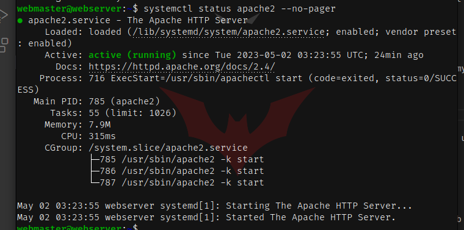

# Deliverable 2

## 1. Virtual Machine Hardware Configuration

In this first step, I created a virtual machine with the following specifications: 2 Processors, 1GB of RAM, 10GB of storage

## 2. Logged into Ubuntu Server

In this step, I downloaded Ubuntu Server from Ubuntu's website and went through the installation process. See screenshot to see me logged in.

## 3. SSH from Desktop to Server

In this step, I used SSH to remotely sign into my server.

## 4. Status of Applications

Status of Apache:

Status of SSH Service:

Status of Uncomplicated Firewall:

## 5. Logs

This is a screenshot of the Apache Log File: access.log

This is a screenshot of the Error Log File: error.log

This is a screenshot of the Authorization Log File: auth.log

## 6. Configuration Files

Here is a screenshot of the sites-available config file.

Here is a screenshot of the Apache config file.

## 7. In this screenshot, you will see the server being accessed from my browser:

