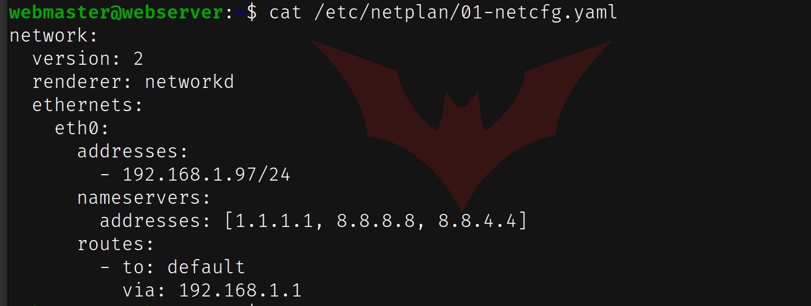

# Deliverable 2

## Step 1: Create a virtual machine for the server

In this first step, I created a virtual machine with the following specifications: 2 Processors, 1GB of RAM, 10GB of storage

## Step 2: Install Ubuntu Server

In this step, I downloaded Ubuntu Server from Ubuntu's website and went through the installation process. See screenshot to see me logged in.

## Step 3: Install Apache

In this step, I downloaded and installed Apache using the default Ubuntu repositories.

## Step 4: Setup the firewall

In the step, I configured the firewall of my web server with the UFW tool

## Step 5: Setup SSH to manage the server from the client virtual machine

In this step, I created a YAML file in the **netplan** folder for my web server, which gave it a static IP address.  I also allowed SSH connections to my webserver by editing the firewall.  I also installed OpenSSH Server on my machine.

## Step 6: Setup Virtual Hosts

In this step, I created a folder for my website, and added files to that folder.  I also created a virtual host for my website.

