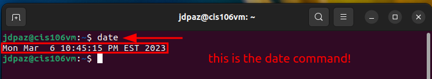
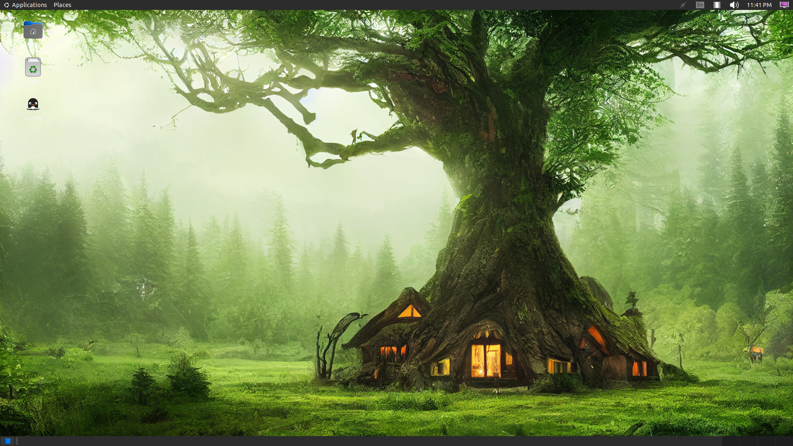

# Lab 3 Submission

## Question 1

## Question 2

## Question 3

| Program purpose     | Package Name     | Version            |
| ------------------- | ---------------- | ------------------ |
| Play a tetris game  | blockattack      | 2.7.0-1            |
| Play a video file   | dragonplayer     | 4:21.12.3-0ubuntu1 |
| Browse the internet | epiphany-browser | 42.4-0ubuntu1      |
| Read your email     | geary            | 40.0-2             |
| Play music          | rhythmbox        | 3.4.4-5ubuntu1     |

## Question 4

| command | what it does |
| ------- | ------------ |
| echo    |              |
| fortune |              |
| cowsay  |              |
| lolcat  |              |
| figlet  |              |
| toilet  |              |
| rig     |              |