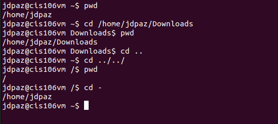
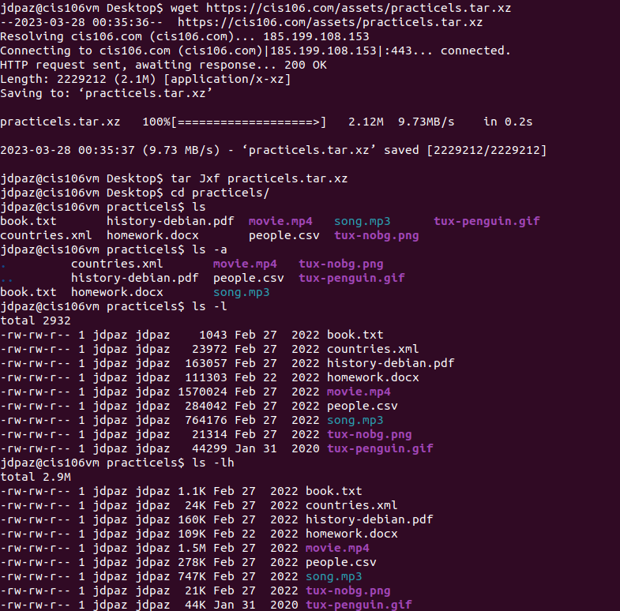
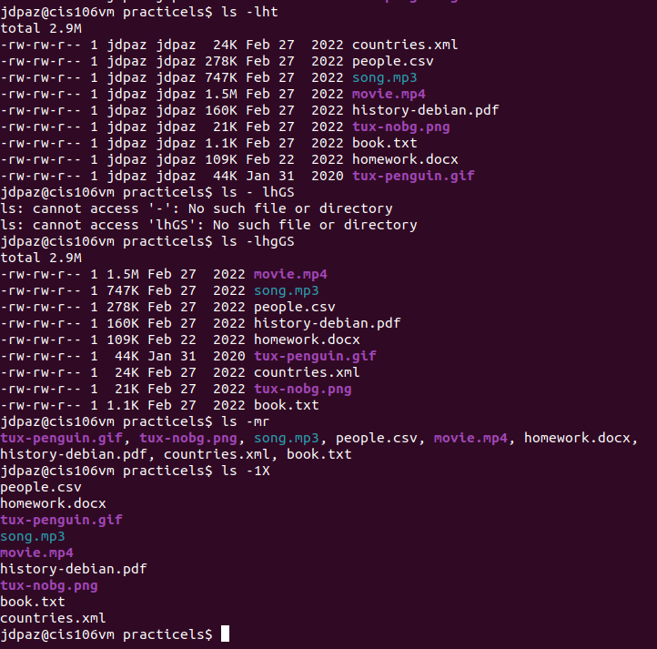
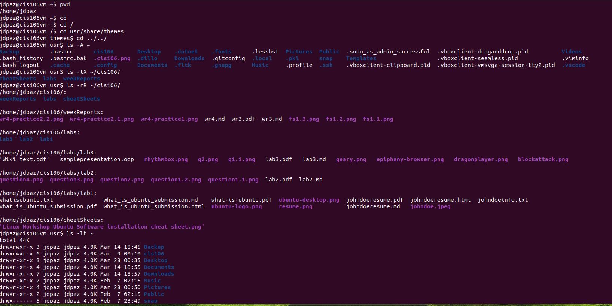
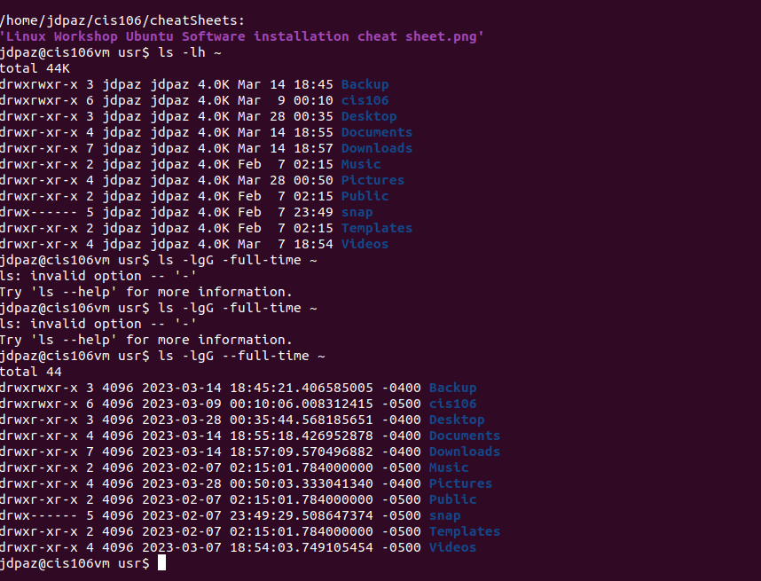
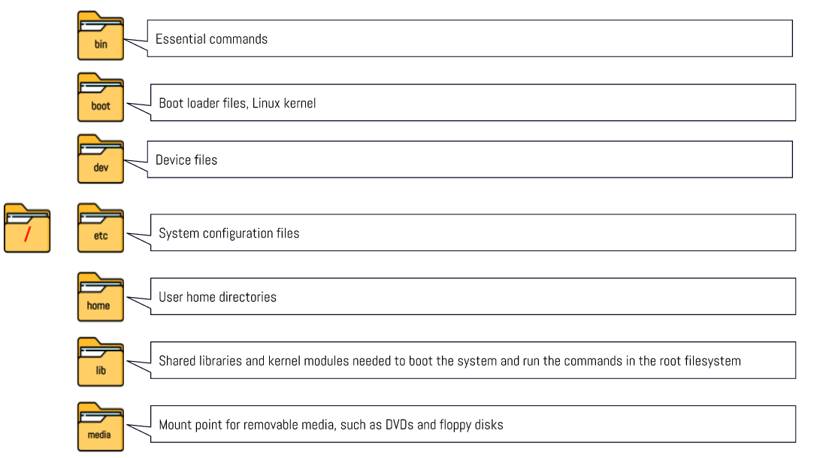
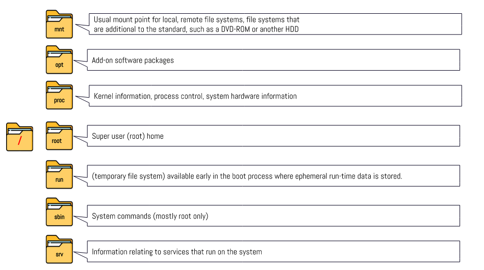
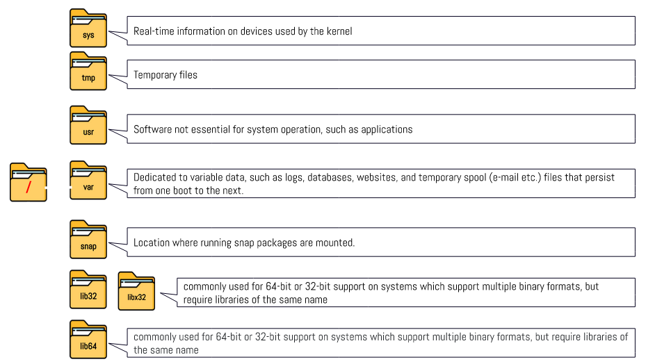

# Week Report 4

## Practice from the presentation: The Linux File System

### Practice 1

### Practice 2

 
 

### Practice 3

 

## The Linux File System Directories and Their Purpose

 
 
 

## All the Commands for Navigating the File System

| Command | What it does                    | Syntax                                            | Example   |
| ------- | ------------------------------- | ------------------------------------------------- | --------- |
| ls      | lists files and directories     | `ls` + `absolute or relative path to directory`   | `ls \etc` |
| cd      | move between directories        | `cd` + `absolute or relative path to a directory` | `cd /etc` |
| pwd     | print current working directory | `pwd`                                             | `pwd`     |

## Basic Terminology

* **File system:** The way in which files are named and where they are placed logically for storage and retrieval
* **Current directory:** The directory your terminal window or command prompt is working in.
* **parent directory:** The directory that contains your current directory
* **the difference between your home directory and the home directory:** Your home directory refers to your own personal user directory that is a subdirectory in /home.  The home directory is the actual /home directory.  It is a subdirectory of the root.
* **pathname:** Indicates the location of the file in the filesystem.
* **relative path:** The location of a file starting from the current working directory or a directory that is located inside the current working directory.
* **absolute path:** The location of a file starting at the root of the file system
