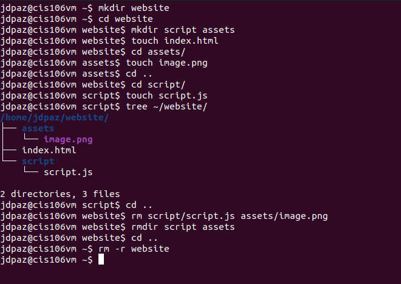
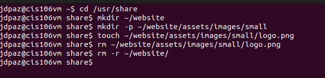
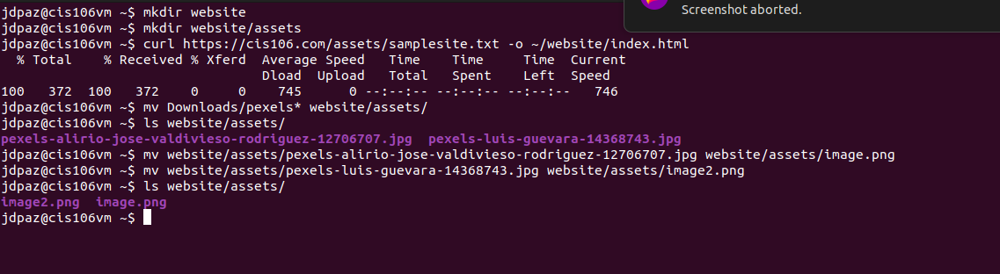
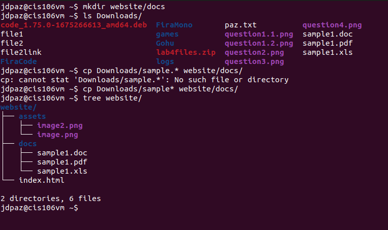

# Week Report 5

## Questions and Answers

* **What are Command Options?**
A single letter or full word that is used with a command, that modifies or enhances it in some way.

* **What are Command Arguments?**
Arguments define what the command acts on.  Can be a file or directory.
Alternate definition: A file name or other data that is provided to a command in order for the command to use it as an input.

* **Which command is used for creating directories? Provide at least 3 examples.**
Command: mkdir
* example 1:
  * Create a directory: 'mkdir toyota'
* example 2:
  * Create a directory and create parent directories as needed: 'mkdir -p cars/toyota/gt86.txt'
* example 3:
  * Create a directory using absolute path: 'mkdir /home/jdpaz/Desktop/ZeldaGames'

* **What does the touch command do? Provide at least 3 examples.**
The touch command updates any given file's timestamp.  If the file does not exist, it creates it.
* example 1:
  * Create a file: 'touch batman.txt'
* example 2:
  * Create a file using absolute path: 'touch /usr/bin/gotham.txt'
* example 3:
  * Create several files: 'touch joker.txt robin.py alfred.log'

* **How do you remove a file? Provide an example.**
To remove a file, you would use the 'rm' command.
* example:
  * Remove a file: rm scarecrow.txt

* **How do you remove a directory and can you remove non-empty directories in Linux? Provide an example**
To remove an empty directory, you would use the 'rmdir' command.  To remove non-empty directories, you would use 'rm -r'
* example 1:
  *  Remove an empty directory: 'rmdir metropolis'
* example 2:
  * Remove a non-empty directory: 'rm -r atlantis'

* **Explain the mv and cp command. Provide at least 2 examples of each**

The 'mv' command moves files and directories from one directory to another or renames a file or directory
* examples:
  * Move a file to a directory using relative path: mv Documents/essay.doc Desktop/
  * Move multiple directories to a different directory: mv music/ videos/ lyrics/ /media/student/flashdrive/

The 'cp' command copies files and directories from a source to a destination.
* examples:
  * Copy a file: cp Downloads/book.pdf Desktop/
  * Copy the content of a directory to another directory: cp Downloads/books/* ~/Desktop/

## Practice 1

## Practice 2

## Practice 3

## Practice 4

